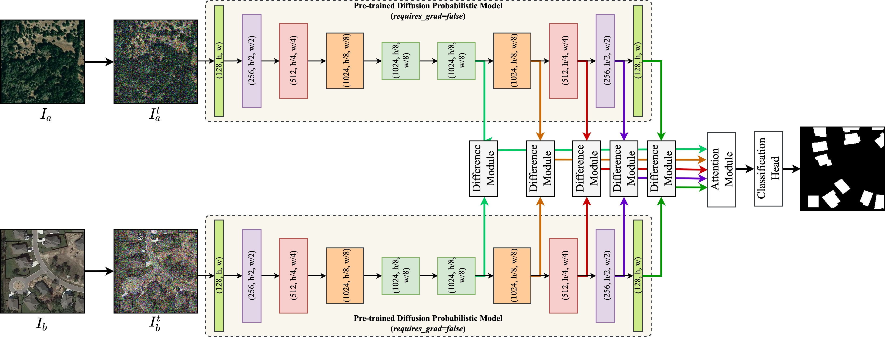

# DDPM-CD: Remote Sensing Change Detection using Denoising Diffusion Probabilistic Models

[`Paper`](https://arxiv.org/abs/2206.11892) |  [`Project`](https://www.wgcban.com/research#h.ar24vwqlm021)

This is the offical **Pytorch** implementation of **Remote Sensing Change Detection using Denoising Diffusion Probabilistic Models**.

## :arrow_forward:Motivation

*Images generated from the diffusion model trained on off-the-shelf remote sensing images. The generated images contain objects that we commonly see in real remote sensing images, such as buildings, trees, roads, vegetation, water surfaces, etc., demonstrating the powerful ability of the diffusion models to extract key semantics that can be further used in remote sensing change detection.*

## :arrow_forward:Method

*We fine-tune a light-weight change detection head which takes multi-level feature representations from the pre-trained diffusion model as inputs and outputs change prediction map.*

## :arrow_forward:Environment
```bash
conda create -n ddpm-cd python=3.9
```
```bash
conda activate ddpm-cd
```
```python
pip3 install -r requirement.txt
```

## :arrow_forward:Training diffusion model with remote sensing data
### :low_brightness:Collect off-the-shelf remote sensing data to train diffusion model

Dump all the remote sensing data sampled from Google Earth Engine and any other publically available remote sensing images to dataset folder or create a simlink. 

### :low_brightness:Training/Resume unconditional diffusion model on remote sensing data

We use ``ddpm_train.json`` to setup the configurations. Update the dataset ``name`` and ``dataroot`` in the json file. Then run the following command to start training the diffusion model. The results and log files will be save to ``experiments`` folder. Also, we upload all the metrics to [wandb](https://wandb.ai/home).

```python
python ddpm_train.py --config config/ddpm_train.json -enable_wandb -log_eval
```

In case, if you want to resume the training from previosely saved point, provide the path to saved model in ``path/resume_state``, else keep it as null.

### :low_brightness:Sampling from the diffusion model
If you want generate samples from the diffusion model, first update the path to trained diffusion model in [`path`][`resume_state`]. Then run the following command.
```python
python ddpm_train.py --config config/ddpm_sampling.json --phase val
```
The generated images will be saved in `experiments`.

## :arrow_forward:Change Detection
### :low_brightness:Download the datasets
Download the change detection datasets from the following links. Place them inside your `datasets` folder.

- [`LEVIR-CD`](https://www.dropbox.com/s/18fb5jo0npu5evm/LEVIR-CD256.zip?dl=0)
- [`WHU-CD`](https://www.dropbox.com/s/r76a00jcxp5d3hl/WHU-CD-256.zip?dl=0)
- [`DSIFN-CD`](https://www.dropbox.com/s/1lr4m70x8jdkdr0/DSIFN-CD-256.zip?dl=0)
- [`CDD`](https://www.dropbox.com/s/ls9fq5u61k8wxwk/CDD.zip?dl=0)


Then, update the paths to those folders here [`datasets`][`train`][`dataroot`], [`datasets`][`val`][`dataroot`], [`datasets`][`test`][`dataroot`] in `levir.json`, `whu.json`, `dsifn.json`, and `cdd.json`.

### Provide the path to pre-trained diffusion model
Udate the path to pre-trained diffusion model weights (`*_gen.pth` and `*_opt.pth`) here [`path`][`resume_state`] in `levir.json`, `whu.json`, `dsifn.json`, and `cdd.json`..

### :low_brightness:Training the change detection network
Run the following code to start the training.
- Training on LEVIR-CD:
    ```python
    python ddpm_cd.py --config config/levir.json -enable_wandb -log_eval
    ```
- Training on WHU-CD:
    ```python
    python ddpm_cd.py --config config/whu.json -enable_wandb -log_eval
    ```
- Training on DSIFN-CD:
    ```python
    python ddpm_cd.py --config config/dsifn.json -enable_wandb -log_eval
    ```
- Training on CDD:
    ```python
    python ddpm_cd.py --config config/cdd.json -enable_wandb -log_eval
    ```

The results will be saved in `experiments` and also upload to `wandb`.

### :low_brightness:Testing
To obtain the predictions and performance metrics (iou, f1, and OA), first provide the path to pre-trained diffusion model here [`path`][`resume_state`] and path to trained change detection model (the best model) here [`path_cd`][`resume_state`] in `levir_test.json`, `whu_test.json`, `dsifn_test.json`, and `cdd_test.json`.

Run the following code to start the training.
- Test on LEVIR-CD:
    ```python
    python ddpm_cd.py --config config/levir_test.json --phase test -enable_wandb -log_eval
    ```
- Test on WHU-CD:
    ```python
    python ddpm_cd.py --config config/whu_test.json --phase test -enable_wandb -log_eval
    ```
- Test on DSIFN-CD:
    ```python
    python ddpm_cd.py --config config/dsifn_test.json --phase test -enable_wandb -log_eval
    ```
- Test on CDD:
    ```python
    python ddpm_cd.py --config config/cdd_test.json --phase test -enable_wandb -log_eval
    ```

Predictions will be saved in `experiments` and performance metrics will be uploaded to wandb.

## :arrow_forward:Pre-trained models & Train/Val/Test logs
### :low_brightness:Links to download pre-trained models
- Pre-trained diffusion model: [`Dropbox`](https://www.dropbox.com/sh/z6k5ixlhkpwgzt5/AAApBOGEUhHa4qZon0MxUfmua?dl=0)
- Pre-trained change detection networks:
    - "t": [50, 100]
        - LEVIR-CD [`Dropbox-cd-levir-50-100`](https://www.dropbox.com/sh/ie9rapb1j2zgvb7/AAALkpLS-tvngTb4HXqAcbbTa?dl=0)
        - WHU-CD [`Dropbox-cd-whu-50-100`](https://www.dropbox.com/sh/9idrobnmhufo1e7/AABRf38iq-wE7plKZZmwFywva?dl=0)
        - DSIFN-CD [`Dropbox-cd-dsifn-50-100`](https://www.dropbox.com/sh/001czxn335bul5g/AACRaR-nqQNNHEge6iSH_z-6a?dl=0)
        - CDD-CD [`Dropbox-cd-cdd-50-100`](https://www.dropbox.com/sh/62wsy9cl8xizx2h/AAB5Dmu-PuOVAfIBugGqlsd8a?dl=0)
    - "t": [50, 100, 400] (*Best Model*)
        - LEVIR-CD [`Dropbox-cd-levir-50-100-400`](https://www.dropbox.com/sh/sx0aopz230lbuwc/AADKpwP30OHvtYub9FYTyk53a?dl=0)
        - WHU-CD [`Dropbox-cd-whu-50-100-400`](https://www.dropbox.com/sh/l8iuzb2tudb3yrk/AAA7aZwb5eM12SamCXPh7R-Ra?dl=0)
        - DSIFN-CD [`Dropbox-cd-dsifn-50-100-400`](https://www.dropbox.com/sh/ekj7kwsohhnjico/AADuz0vBtxCCrYgdgOCG3LX5a?dl=0)
        - CDD-CD [`Dropbox-cd-cdd-50-100-400`](https://www.dropbox.com/sh/a8dj1i8pnexd5yu/AADnmBGT4VdGY8aZMo7enfS7a?dl=0)
    - "t": [50, 100, 400, 650]
        - LEVIR-CD [`Dropbox-cd-levir-50-100-400-650`](https://www.dropbox.com/sh/sx0aopz230lbuwc/AADKpwP30OHvtYub9FYTyk53a?dl=0)
        - WHU-CD [`Dropbox-cd-whu-50-100-400-650`](https://www.dropbox.com/sh/l8iuzb2tudb3yrk/AAA7aZwb5eM12SamCXPh7R-Ra?dl=0)
        - DSIFN-CD [`Dropbox-cd-dsifn-50-100-400-650`](https://www.dropbox.com/sh/ekj7kwsohhnjico/AADuz0vBtxCCrYgdgOCG3LX5a?dl=0)
        - CDD-CD [`Dropbox-cd-cdd-50-100-400-650`](https://www.dropbox.com/sh/a8dj1i8pnexd5yu/AADnmBGT4VdGY8aZMo7enfS7a?dl=0)
 
 - All pre-trained models in **GooleDrive**: [GoogleDrive-pretrianed-models](https://drive.google.com/file/d/1RXWtGdSNCBEAf7nr61uNyZP6HwNl_Zyi/view?usp=sharing)

### :low_brightness:Train/Val Reports on `wandb`
- [`LEVIR-CD-Train-Val-Reports-Wandb`](https://wandb.ai/wgcban/ddpm-RS-CDHead/reports/Change-Detection-Results-on-LEVIR-CD-Dataset--VmlldzoyMDE5MzIz?accessToken=3hubg8q23d3527klbojjdhklo8h66k5k1acrly6jtoxd7du35vwyci9dwv8urmin)
- [`WHU-CD-Train-Val-reports-Wandb`](https://wandb.ai/wgcban/ddpm-RS-CDHead/reports/Change-Detection-on-WHU-CD-Dataset--VmlldzoyMDE5NDA0?accessToken=5d8a9q6g008ct94lx5171knen1dd9xpptzohe92ic65rx3wflkciq1rhbp4bozca)
- [`DSIFN-CD-Train-Val-Reports-Wandb`](https://wandb.ai/wgcban/ddpm-RS-CDHead/reports/Change-Detection-on-DSIFN-CD-Dataset--VmlldzoyMDE5NDMy?accessToken=hfef99pxr03pi4zxmcw3jkpo2na1sd1c5t7stai2vl76908fnh3wnrhcy4mfoaae)
- [`CDD-CD-Train-Val-Reports-Wandb`](https://wandb.ai/wgcban/ddpm-RS-CDHead/reports/Change-Detection-on-CDD-Dataset--VmlldzoyMDE5NDQw?accessToken=l4omatpi7jng6mw32hp7oh0wkqet8jne3wkqrb6hxigpjluv4yy9yzdir62ics9y)

### :low_brightness:Test results on `wandb`
- [`LEVIR-WHU-DSIFN-CDD-Test-Results`](https://wandb.ai/wgcban/ddpm-RS-CDHead/reports/Change-Detection-Performance-on-Test-sets-of-LEVIR-CD-WHU-CD-DSIFN-CD-and-CDD--VmlldzoyMDE5NDg5?accessToken=6eikgovmk7ct25ar00eggsuslh8bzdz9e8215qn5xa0omqe5uo5u1jf4lh2liajx)

## :arrow_forward:Results
### :low_brightness:Quantitative


### :low_brightness:Qualitative
- LEVIR-CD
    
- WHU-CD
    
- DSIFN-CD
    
- CDD
    


## :arrow_forward:Citation
```
@misc{https://doi.org/10.48550/arxiv.2206.11892,
  doi = {10.48550/ARXIV.2206.11892},
  
  url = {https://arxiv.org/abs/2206.11892},
  
  author = {Bandara, Wele Gedara Chaminda and Nair, Nithin Gopalakrishnan and Patel, Vishal M.},
  
  keywords = {Computer Vision and Pattern Recognition (cs.CV), Machine Learning (cs.LG), FOS: Computer and information sciences, FOS: Computer and information sciences},
  
  title = {Remote Sensing Change Detection (Segmentation) using Denoising Diffusion Probabilistic Models},
  
  publisher = {arXiv},
  
  year = {2022},
  
  copyright = {Creative Commons Attribution 4.0 International}
}
```


## :arrow_forward:References
- The code of diffusion model is from [`here`](https://github.com/Janspiry/Image-Super-Resolution-via-Iterative-Refinement).


