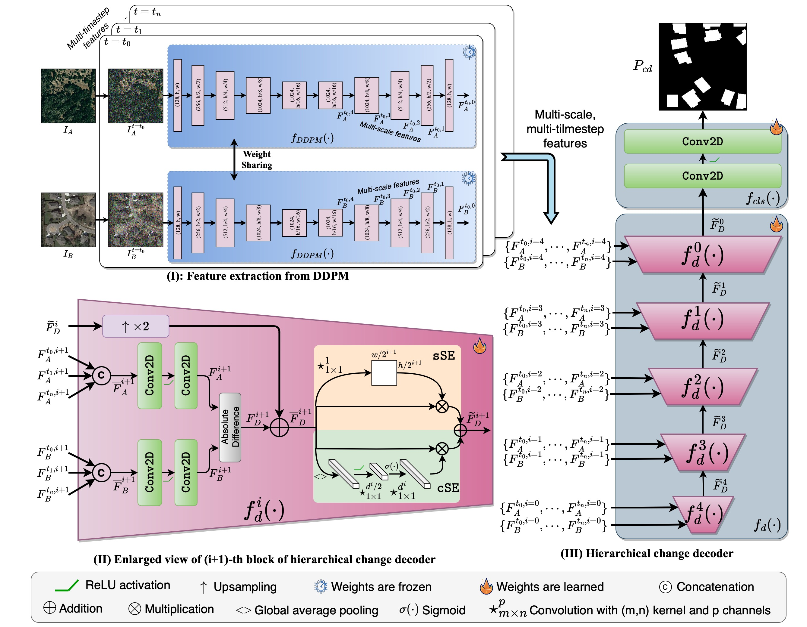
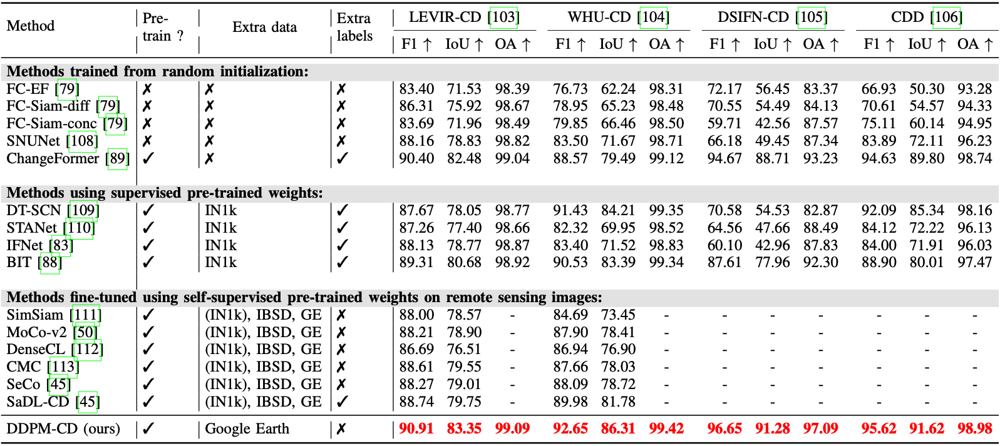
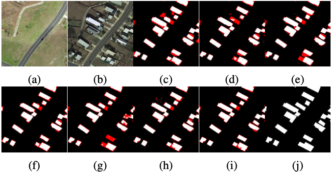
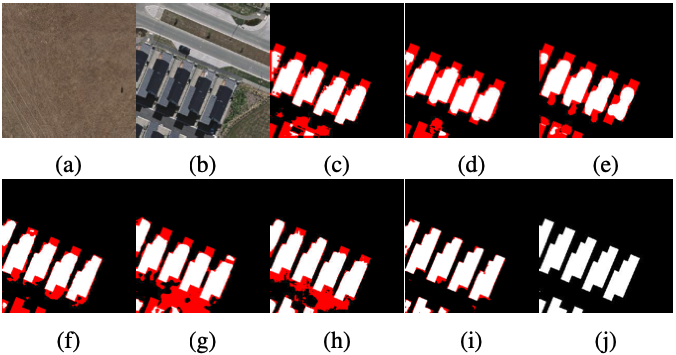
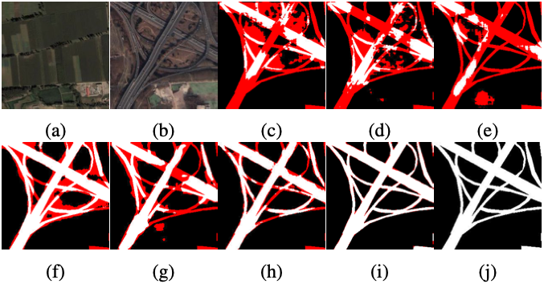
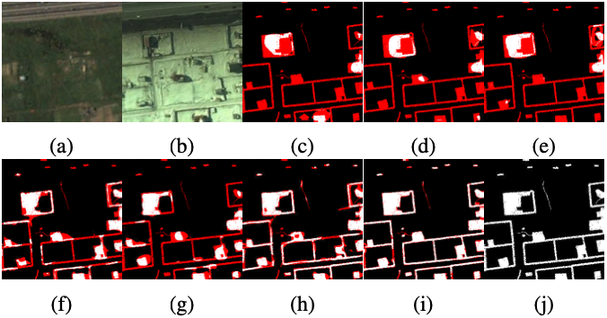

# DDPM-CD: Denoising Diffusion Probabilistic Models as Feature Extractors for Change Detection (WACV'25)
(Previosely: DDPM-CD: Remote Sensing Change Detection using Denoising Diffusion Probabilistic Models)

> [Wele Gedara Chaminda Bandara](https://www.wgcban.com), [Nithin Gopalakrishnan Nair](https://nithin-gk.github.io), [Vishal M. Patel](https://engineering.jhu.edu/faculty/vishal-patel/)

> Offical Pytorch implementation of DDPM-CD: Denoising Diffusion Probabilistic Models as Feature Extractors for Change Detection / Remote Sensing Change Detection using Denoising Diffusion Probabilistic Models

> [Latest Version of the Paper](https://arxiv.org/abs/2206.11892)

### Updates:
- 🎉 DDPM-CD has been accepted at IEEE/CVF Winter Conference on Applications of Computer Vision (WACV) 2025.
- :exclamation: Paper-v3: We have (completely) revised the wrting of our paper. Please refer to [v3 on arxiv](https://arxiv.org/abs/2206.11892v3). 

## 1. Motivation & Contribution


> Images sampled from the DDPM model pre-trained on off-the-shelf remote sensing images.

- Images generated from the pre-trained diffusion model trained on off-the-shelf remote sensing images.
- The generated images exhibit common objects typically observed in real remote sensing imagery, including buildings, trees, roads, vegetation, water surfaces, etc.
- This showcases the remarkable capability of diffusion models to grasp essential semantics from the training dataset.
- Although our primary focus isn't image synthesis, we explore the effectiveness of DDPM as a feature extractor for change detection.

## 2. Method


> We fine-tune a lightweight change classifier utilizing the feature representations produced by the pre-trained DDPM alongside change labels

## 3. Usage
### 3.1 Requirements
Before using this repository, make sure you have the following prerequisites installed:

- [Anaconda](https://www.anaconda.com/download/)
- [PyTorch](https://pytorch.org)

You can install PyTorch with the following [command](https://pytorch.org/get-started/locally/) (in Linux OS):
```bash
conda install pytorch torchvision pytorch-cuda=11.8 -c pytorch -c nvidia
```

### 3.2 Installation

To get started, clone this repository:
```bash
git clone https://github.com/wgcban/ddpm-cd.git
```

Next, create the [conda](https://docs.conda.io/projects/conda/en/stable/) environment named `ddpm-cd` by executing the following command:
```bash
conda env create -f environment.yml
```

Then activate the environment:
```bash
conda activate ddpm-cd
```

Download the datasets and place them in the `dataset` folder. **->[See Section 5.1 for download links.](https://github.com/wgcban/ddpm-cd/tree/master#51-download-the-change-detection-datasets)**

If you wish to only test, download the pre-trained DDPM and fine-tuned DDPM-CD models and place them in the `experiments` folder. **->[See Section 7 for links.](https://github.com/wgcban/ddpm-cd#7-links-to-download-pre-trained-models)**

All the train-val-test statistics will be automatically upload to [`wandb`](https://wandb.ai/home), and please refer [`wandb-quick-start`](https://wandb.ai/quickstart?utm_source=app-resource-center&utm_medium=app&utm_term=quickstart) documentation if you are not familiar with using `wandb`. 

## 4. Pre-training DDPM
### 4.1 Collect off-the-shelf remote sensing data to train diffusion model

Dump all the remote sensing data sampled from Google Earth Engine and any other publically available remote sensing images to dataset folder or create a [simlink](https://www.geeksforgeeks.org/python-os-symlink-method/). 

### 4.2 Pre-train/resume (unconditional) DDPM

We use `ddpm_train.json` to setup the configurations. Update the dataset `name` and `dataroot` in the json file. Then run the following command to start training the diffusion model. The results and log files will be save to ``experiments`` folder. Also, we upload all the metrics to [wandb](https://wandb.ai/home).

```python
python ddpm_train.py --config config/ddpm_train.json -enable_wandb -log_eval
```

In case, if you want to resume the training from previosely saved point, provide the path to saved model in ``path/resume_state``, else keep it as `null`.

### 4.3 Sampling from the pre-trained DDPM
If you want generate samples from the pre-trained DDPM, first update the path to trained diffusion model in [`path`][`resume_state`]. Then run the following command.
```python
python ddpm_train.py --config config/ddpm_sampling.json --phase val
```
The generated images will be saved in `experiments`.

## 5. Fine-tuning for change detection
### 5.1 Download the change detection datasets
Download the change detection datasets from the following links. Place them inside your `datasets` folder.

- [`LEVIR-CD`](https://www.dropbox.com/s/18fb5jo0npu5evm/LEVIR-CD256.zip?dl=0)
- [`WHU-CD`](https://www.dropbox.com/s/r76a00jcxp5d3hl/WHU-CD-256.zip?dl=0)
- [`DSIFN-CD`](https://www.dropbox.com/s/1lr4m70x8jdkdr0/DSIFN-CD-256.zip?dl=0)
- [`CDD`](https://www.dropbox.com/s/ls9fq5u61k8wxwk/CDD.zip?dl=0)


Then, update the paths to those folders here [`datasets`][`train`][`dataroot`], [`datasets`][`val`][`dataroot`], [`datasets`][`test`][`dataroot`] in `levir.json`, `whu.json`, `dsifn.json`, and `cdd.json`.

### 5.2 Provide the path to pre-trained diffusion model
Udate the path to pre-trained diffusion model weights (`*_gen.pth` and `*_opt.pth`) here [`path`][`resume_state`] in `levir.json`, `whu.json`, `dsifn.json`, and `cdd.json`..

### 5.3 Indicate time-steps used for feature extraction
Indicate the time-steps using to extract feature representations in [`model_cd`][`t`]. As shown in the ablation section of the paper, our best model is obtained with time-steps: {50,100,400}. However, time-steps of {50,100} works well too.

### 5.4 Start fine-tuning for change detection
Run the following code to start the training.
- Training on LEVIR-CD:
    ```python
    python ddpm_cd.py --config config/levir.json -enable_wandb -log_eval
    ```
- Training on WHU-CD:
    ```python
    python ddpm_cd.py --config config/whu.json -enable_wandb -log_eval
    ```
- Training on DSIFN-CD:
    ```python
    python ddpm_cd.py --config config/dsifn.json -enable_wandb -log_eval
    ```
- Training on CDD:
    ```python
    python ddpm_cd.py --config config/cdd.json -enable_wandb -log_eval
    ```

The results will be saved in `experiments` and also upload to `wandb`.

## 6. Testing
To obtain the predictions and performance metrics (IoU, F1, and OA), first provide the path to pre-trained diffusion model here [`path`][`resume_state`] and path to trained change detection model (the best model) here [`path_cd`][`resume_state`] in `levir_test.json`, `whu_test.json`, `dsifn_test.json`, and `cdd_test.json`. Also make sure you specify the time steps used in fine-tuning here: [`model_cd`][`t`].

Run the following code to start the training.
- Test on LEVIR-CD:
    ```python
    python ddpm_cd.py --config config/levir_test.json --phase test -enable_wandb -log_eval
    ```
- Test on WHU-CD:
    ```python
    python ddpm_cd.py --config config/whu_test.json --phase test -enable_wandb -log_eval
    ```
- Test on DSIFN-CD:
    ```python
    python ddpm_cd.py --config config/dsifn_test.json --phase test -enable_wandb -log_eval
    ```
- Test on CDD:
    ```python
    python ddpm_cd.py --config config/cdd_test.json --phase test -enable_wandb -log_eval
    ```

Predictions will be saved in `experiments` and performance metrics will be uploaded to wandb.

## 7. Links to download pre-trained models
### 7.1 Pre-trianed DDPM
Pre-trained diffusion model can be download from: [`Dropbox`](https://www.dropbox.com/sh/z6k5ixlhkpwgzt5/AAApBOGEUhHa4qZon0MxUfmua?dl=0)

### 7.2 Fine-tuned DDPM-CD models
Fine-tunes chande detection networks can be download from following links:
- "t": [50, 100]
    - LEVIR-CD [`Dropbox-cd-levir-50-100`](https://www.dropbox.com/sh/ie9rapb1j2zgvb7/AAALkpLS-tvngTb4HXqAcbbTa?dl=0)
    - WHU-CD [`Dropbox-cd-whu-50-100`](https://www.dropbox.com/sh/9idrobnmhufo1e7/AABRf38iq-wE7plKZZmwFywva?dl=0)
    - DSIFN-CD [`Dropbox-cd-dsifn-50-100`](https://www.dropbox.com/sh/001czxn335bul5g/AACRaR-nqQNNHEge6iSH_z-6a?dl=0)
    - CDD-CD [`Dropbox-cd-cdd-50-100`](https://www.dropbox.com/sh/62wsy9cl8xizx2h/AAB5Dmu-PuOVAfIBugGqlsd8a?dl=0)

- "t": [50, 100, 400] (*Best Model*)
    - LEVIR-CD [`Dropbox-cd-levir-50-100-400`](https://www.dropbox.com/sh/sx0aopz230lbuwc/AADKpwP30OHvtYub9FYTyk53a?dl=0)
    - WHU-CD [`Dropbox-cd-whu-50-100-400`](https://www.dropbox.com/sh/l8iuzb2tudb3yrk/AAA7aZwb5eM12SamCXPh7R-Ra?dl=0)
    - DSIFN-CD [`Dropbox-cd-dsifn-50-100-400`](https://www.dropbox.com/sh/ekj7kwsohhnjico/AADuz0vBtxCCrYgdgOCG3LX5a?dl=0)
    - CDD-CD [`Dropbox-cd-cdd-50-100-400`](https://www.dropbox.com/sh/a8dj1i8pnexd5yu/AADnmBGT4VdGY8aZMo7enfS7a?dl=0)

- "t": [50, 100, 400, 650]
    - LEVIR-CD [`Dropbox-cd-levir-50-100-400-650`](https://www.dropbox.com/sh/sx0aopz230lbuwc/AADKpwP30OHvtYub9FYTyk53a?dl=0)
    - WHU-CD [`Dropbox-cd-whu-50-100-400-650`](https://www.dropbox.com/sh/l8iuzb2tudb3yrk/AAA7aZwb5eM12SamCXPh7R-Ra?dl=0)
    - DSIFN-CD [`Dropbox-cd-dsifn-50-100-400-650`](https://www.dropbox.com/sh/ekj7kwsohhnjico/AADuz0vBtxCCrYgdgOCG3LX5a?dl=0)
    - CDD-CD [`Dropbox-cd-cdd-50-100-400-650`](https://www.dropbox.com/sh/a8dj1i8pnexd5yu/AADnmBGT4VdGY8aZMo7enfS7a?dl=0)
 
 ### 7.2 Downloading from GoogleDrive/GitHub
 If you face a problem when downloading from the DropBox try one of the following options:
 - [GoogleDrive] All pre-trained models in **GooleDrive**: [GoogleDrive-pretrianed-models](https://drive.google.com/file/d/1RXWtGdSNCBEAf7nr61uNyZP6HwNl_Zyi/view?usp=sharing)
 - [GitHub] [Pre-trained-models in GitHub](https://github.com/wgcban/ddpm-cd/releases/tag/initial_release)
 

### 7.3 Train/Val Reports on `wandb`
- [`LEVIR-CD-Train-Val-Reports-Wandb`](https://wandb.ai/wgcban/ddpm-RS-CDHead/reports/Change-Detection-Results-on-LEVIR-CD-Dataset--VmlldzoyMDE5MzIz?accessToken=3hubg8q23d3527klbojjdhklo8h66k5k1acrly6jtoxd7du35vwyci9dwv8urmin)
- [`WHU-CD-Train-Val-reports-Wandb`](https://wandb.ai/wgcban/ddpm-RS-CDHead/reports/Change-Detection-on-WHU-CD-Dataset--VmlldzoyMDE5NDA0?accessToken=5d8a9q6g008ct94lx5171knen1dd9xpptzohe92ic65rx3wflkciq1rhbp4bozca)
- [`DSIFN-CD-Train-Val-Reports-Wandb`](https://wandb.ai/wgcban/ddpm-RS-CDHead/reports/Change-Detection-on-DSIFN-CD-Dataset--VmlldzoyMDE5NDMy?accessToken=hfef99pxr03pi4zxmcw3jkpo2na1sd1c5t7stai2vl76908fnh3wnrhcy4mfoaae)
- [`CDD-CD-Train-Val-Reports-Wandb`](https://wandb.ai/wgcban/ddpm-RS-CDHead/reports/Change-Detection-on-CDD-Dataset--VmlldzoyMDE5NDQw?accessToken=l4omatpi7jng6mw32hp7oh0wkqet8jne3wkqrb6hxigpjluv4yy9yzdir62ics9y)

### 7.4 Test results on `wandb`
- [`LEVIR-WHU-DSIFN-CDD-Test-Results`](https://wandb.ai/wgcban/ddpm-RS-CDHead/reports/Change-Detection-Performance-on-Test-sets-of-LEVIR-CD-WHU-CD-DSIFN-CD-and-CDD--VmlldzoyMDE5NDg5?accessToken=6eikgovmk7ct25ar00eggsuslh8bzdz9e8215qn5xa0omqe5uo5u1jf4lh2liajx)

## 8. Results
### 8.1 Quantitative


> The average quantitative change detection results on the LEVIR-CD, WHU-CD, DSIFN-CD, and CDD test- sets. “-” indicates not reported or not available to us. (IN1k) indicates pre-training process is initialized with the ImageNet pre-trained weights. IN1k, IBSD, and GE refers to ImageNet1k, Inria Building Segmentation Dataset, and Google Earth.


### 8.2 Qualitative
- LEVIR-CD

    

    > (a) Pre-change image, (b) Post-change image, (c) FC-EF, (d) FC-Siam-diff, (e) FC-Siam- conc, (f) DT-SCN, (g) BIT, (h) ChangeFormer, (i) DDPM-CD (ours), and (j) Ground-truth. Note: true positives (change class) are indicated in white, true negatives (no-change class) are indicated in black, and false positives plus false negatives indicates in red.

- WHU-CD

    

    > (a) Pre-change image, (b) Post-change image, (c) FC-EF, (d) FC-Siam-diff, (e) FC-Siam- conc, (f) DT-SCN, (g) BIT, (h) ChangeFormer, (i) DDPM-CD (ours), and (j) Ground-truth. Note: true positives (change class) are indicated in white, true negatives (no-change class) are indicated in black, and false positives plus false negatives indicates in red

- DSIFN-CD

    

    > (a) Pre-change image, (b) Post-change image, (c) FC-EF, (d) FC-Siam-diff, (e) FC-Siam- conc, (f) DT-SCN, (g) BIT, (h) ChangeFormer, (i) DDPM-CD (ours), and (j) Ground-truth. Note: true positives (change class) are indicated in white, true negatives (no-change class) are indicated in black, and false positives plus false negatives indicates in red

- CDD

    

    > (a) Pre-change image, (b) Post-change image, (c) FC-EF, (d) FC-Siam-diff, (e) FC-Siam- conc, (f) DT-SCN, (g) BIT, (h) ChangeFormer, (i) DDPM-CD (ours), and (j) Ground-truth. Note: true positives (change class) are indicated in white, true negatives (no-change class) are indicated in black, and false positives plus false negatives indicates in red


## 9. Citation
```bibtex
@misc{bandara2024ddpmcdv2,
    title = {Remote Sensing Change Detection (Segmentation) using Denoising Diffusion Probabilistic Models},
    author = {Bandara, Wele Gedara Chaminda and Nair, Nithin Gopalakrishnan and Patel, Vishal M.},
    year = {2022},
    eprint={2206.11892},
    archivePrefix={arXiv},
    primaryClass={cs.CV},
    doi = {10.48550/ARXIV.2206.11892},
}
```
```bibtex
@misc{bandara2024ddpmcdv3,
    title={DDPM-CD: Denoising Diffusion Probabilistic Models as Feature Extractors for Change Detection}, 
    author={Wele Gedara Chaminda Bandara and Nithin Gopalakrishnan Nair and Vishal M. Patel},
    year={2024},
    eprint={2206.11892},
    archivePrefix={arXiv},
    primaryClass={cs.CV},
    doi = {10.48550/ARXIV.2206.11892},
}
```

## 10. References
- The code of diffusion model is from [`here`](https://github.com/Janspiry/Image-Super-Resolution-via-Iterative-Refinement).


